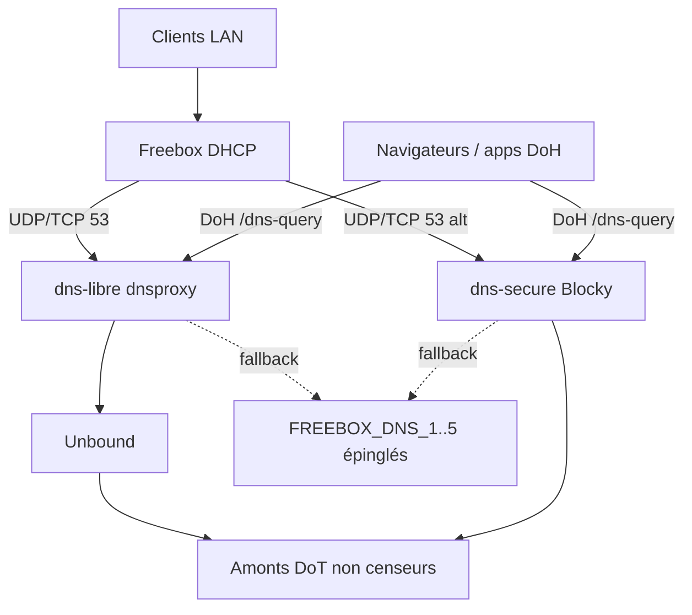

# Freebox Dual DNS — dns-libre + dns-secure

Stack DNS open-source pour **Freebox** (Delta / Ultra / VM Freebox locale), aussi **Raspberry Pi** et **Windows / WSL2**.

Deux personnalités locales, chacune en **DNS classique (UDP/TCP)** et **DoH** (`/dns-query`) :

| Service | Rôle | Filtrage |
| --- | --- | --- |
| **dns-libre** | Résolutions complètes, amonts non censeurs | Aucun filtre « DNS menteur » / politique |
| **dns-secure** | Même base + listes **anti-pub** et **anti-malware** | Pas de censure politique |

Repli intelligent vers une liste **épinglée une fois** de 5 DNS Freebox/LAN (`FREEBOX_DNS_1..5`). **Aucun sondage distant ultérieur** de votre Freebox.

## English (short)

Self-hosted dual DNS for Freebox / Pi / WSL: **dns-libre** (uncensoring) and **dns-secure** (ads + malware only). Docker Compose, DoH + classic DNS, pinned Freebox fallbacks, GitHub Actions for list refresh & health. MIT.

## Architecture



## Prérequis

- Docker Engine + Docker Compose v2 (Docker Desktop, Freebox VM, Pi OS, ou WSL2)
- Ports libres (lab par défaut) : `5353` / `5354` (DNS), `8443` / `8444` (DoH), `3080` (UI Blocky)
- En prod LAN : mappez `53` et éventuellement `443` si rien d’autre ne les occupe

## Démarrage rapide

```bash
cp .env.example .env
# Ajuster HOST_IP = IP LAN de la machine Docker

# Certificats DoH auto-signés
bash scripts/generate-certs.sh
# Windows (PowerShell) :
#   powershell -File scripts\generate-certs.ps1

docker compose up -d
bash scripts/health-check.sh
```

Tests manuels :

```bash
dig @127.0.0.1 -p 5353 example.com +short          # dns-libre
dig @127.0.0.1 -p 5354 example.com +short          # dns-secure
curl -sk "https://127.0.0.1:8443/dns-query?name=example.com&type=A"
curl -sk "https://127.0.0.1:8444/dns-query?name=example.com&type=A"
```

UI Blocky : [http://127.0.0.1:3080](http://127.0.0.1:3080)

## Freebox DHCP

1. Freebox OS → **Paramètres de la Freebox** → **DHCP** (ou Mode avancé → DHCP).
2. DNS primaire = IP LAN de **dns-libre** (ex. `192.168.1.50` si ports 53 mappés, sinon documentez le port lab).
3. DNS secondaire = IP LAN de **dns-secure**, ou le même hôte avec l’autre port / IP.
4. DoH : configurez les clients capables vers `https://<IP>:8443/dns-query` (libre) ou `:8444` (secure). Le DHCP Freebox reste en DNS plain.

Docs détaillées : [docs/freebox.md](docs/freebox.md), [docs/deploy-pi.md](docs/deploy-pi.md), [docs/deploy-wsl.md](docs/deploy-wsl.md).

## Fallbacks Freebox épinglés

Sur ce dépôt, les 5 DNS ont été **capturés une fois** depuis le LAN (DHCP Windows + `mafreebox.freebox.fr/api_version`) et gravés dans :

- `config/freebox-dns-snapshot.json`
- `.env.example` (`FREEBOX_DNS_1..5`)

| Variable | Valeur épinglée |
| --- | --- |
| FREEBOX_DNS_1 | 91.239.100.100 |
| FREEBOX_DNS_2 | 185.95.218.42 |
| FREEBOX_DNS_3 | 9.9.9.10 |
| FREEBOX_DNS_4 | 45.90.28.0 |
| FREEBOX_DNS_5 | 192.168.1.254 |

**Politique :** ne jamais re-interroger la Freebox depuis le CI ou un service distant. Pour mettre à jour : éditez le snapshot + `.env` **en local**.

Si vous forkez sans snapshot : laissez les placeholders et renseignez une fois (DHCP client ou Freebox OS → DNS).

## CI (GitHub Actions)

- Validation `docker compose config`
- Contrôle santé des amonts DoT / DNS épinglés
- Rafraîchissement périodique des métadonnées de blocklists (secure)

## Licence

MIT — voir [LICENSE](LICENSE).

## Ouvrir dans Cursor

Voir [OPEN-IN-CURSOR.md](OPEN-IN-CURSOR.md).
