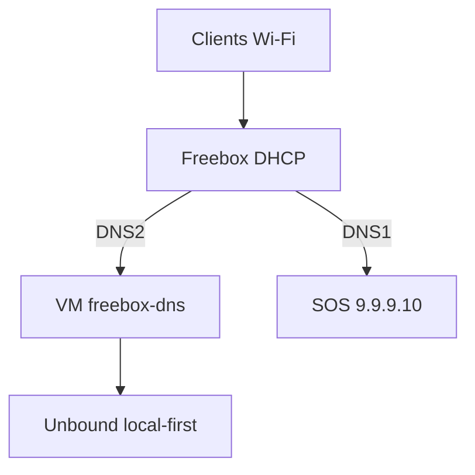

# Freebox Dual DNS — le résolveur est la **VM Freebox**, pas votre PC

**Production** : Docker sur la **VM Freebox OS** (ARM64). Wi‑Fi / Ethernet → DHCP Freebox → IP de cette VM.  
PC Windows / WSL = **lab uniquement**.

| | |
| --- | --- |
| **Guides** | [dlnraja.github.io/freebox-dns](https://dlnraja.github.io/freebox-dns/) |
| **Crédits** | [docs/CREDITS.md](docs/CREDITS.md) |
| **Changelog** | [CHANGELOG.md](CHANGELOG.md) |
| **Features** | [FEATURES.md](FEATURES.md) |
| **Pi-hole-like** | [docs/pihole-parity.md](docs/pihole-parity.md) |

## Modes (smart spit)

Hosts locaux → filtre → Unbound (local-data / cache → DoT → root).

| Mode | Service | Prod | DoH | Rôle |
| --- | --- | --- | --- | --- |
| **uncensored** | dns-libre | `:53` | `:8453` | Aucun denylist |
| **malware** | dns-malware | `:5357` | `:8445` | Menaces |
| **antipub** | dns-antipub | `:5358` | `:8446` | Pubs + uBlock DNS + anti-adblock |
| **secure** | dns-secure | `:5354` | `:8444` | Full Pi-hole-like + UI `:3080` + query log CSV |

## Pi-hole / uBlock (via Blocky)

Pas de Pi-hole FTL : **Blocky** fournit gravity multi-listes, whitelist, groupes, NXDOMAIN, refresh 12h, UI et journal CSV local sur `secure`.  
Détail : [docs/filtering.md](docs/filtering.md) · [docs/pihole-parity.md](docs/pihole-parity.md).

```bash
# Whitelist / blacklist fichiers
# config/blocky/lists/allowlist.txt · ads-extra.txt · malware-extra.txt
bash scripts/blocky-refresh-lists.sh   # force refresh (gravity-like)
# UI : http://IP_VM:3080
```

## DHCP / Wi‑Fi

| DNS1 | DNS2 |
| --- | --- |
| `9.9.9.10` (SOS Quad9) | IP_VM (ex. `192.168.1.71`) |

Guide : [docs/wifi-lan.md](docs/wifi-lan.md) · Pages : [Wi‑Fi / LAN](https://dlnraja.github.io/freebox-dns/guides/wifi-lan.html)

## Architecture



## Prod — Freebox VM

1. QCOW2 ARM64 + cloud-init — [packaging/freebox-os-import/](packaging/freebox-os-import/)
2. `dig @IP_VM example.com`
3. Freebox DHCP : DNS1=`9.9.9.10`, DNS2=`IP_VM`
4. Warm : `python3 scripts/warm-local-cache.py` · `bash scripts/warm-unbound-runtime.sh`

## Lab — PC / WSL (pas en DHCP Freebox)

```bash
cp .env.example .env
bash scripts/generate-certs.sh
docker compose up -d
bash scripts/health-check.sh
```

## Docs utiles

| Doc | Sujet |
| --- | --- |
| [docs/README.md](docs/README.md) | Index |
| [docs/resilience.md](docs/resilience.md) | Local-first Unbound |
| [docs/anti-lie-dns.md](docs/anti-lie-dns.md) | Anti–DNS menteur |
| [docs/encrypted-dns.md](docs/encrypted-dns.md) | DoH / DoT / DoQ |
| [CONTRIBUTING.md](CONTRIBUTING.md) | Contribuer |
| [SECURITY.md](SECURITY.md) | Sécurité |

## Licence

MIT — [LICENSE](LICENSE).
