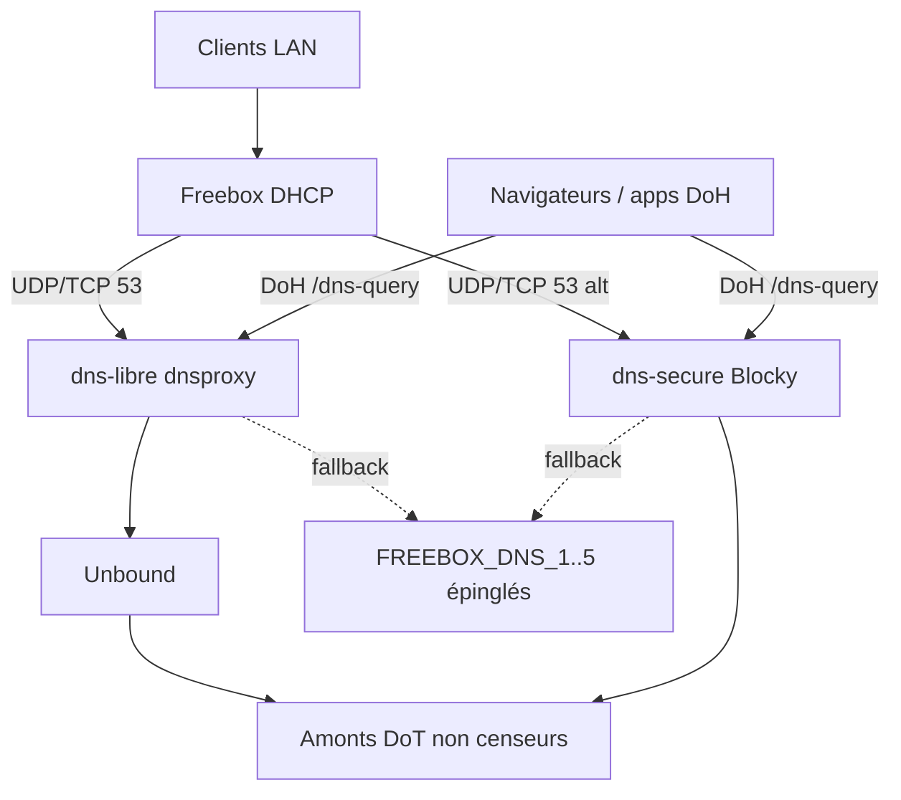

# Freebox Dual DNS — dns-libre + dns-secure

Stack DNS open-source pour **Freebox** (Delta / Ultra / VM Freebox locale), aussi **Raspberry Pi** et **Windows / WSL2**.

Deux personnalités locales, chacune en **DNS classique (UDP/TCP)** et **DoH** (`/dns-query`) :

| Service | Bit (lexique pins) | Filtrage |
| --- | --- | --- |
| **dns-libre** | `uncensored` ← UncensoredDNS + DG + Quad9 Unsecured | Aucun (*keine Sperrlisten*) |
| **dns-secure** | `threat-local` ← toolkit NextDNS (sans cloud/parental) | Ads + malware **locaux** seulement |

Lexique détaillé : [docs/dns-lexicon.md](docs/dns-lexicon.md).

Repli intelligent vers une liste **épinglée une fois** de 5 DNS Freebox/LAN (`FREEBOX_DNS_1..5`). **Aucun sondage distant ultérieur** de votre Freebox.

## English (short)

Self-hosted dual DNS for Freebox / Pi / WSL: **dns-libre** (uncensoring) and **dns-secure** (ads + malware only). Docker Compose, DoH + classic DNS, pinned Freebox fallbacks, GitHub Actions for list refresh & health. MIT.

## Architecture



## Prérequis

- Docker Engine + Docker Compose v2 (Docker Desktop, Freebox VM, Pi OS, ou WSL2)
- Ports libres (lab par défaut) : `5356` / `5354` (DNS), `8453` / `8444` (DoH), `3080` (UI Blocky)
- En prod LAN : mappez `53` et éventuellement `443` si rien d’autre ne les occupe

## Démarrage rapide

```bash
cp .env.example .env
# Ajuster HOST_IP = IP LAN de la machine Docker (bind local-only)

# Certificats DoH auto-signés
bash scripts/generate-certs.sh
# Windows (PowerShell) :
#   powershell -File scripts\generate-certs.ps1

# Lab (ports 5356/5354 — Windows / WSL)
docker compose up -d

# Prod Freebox VM / Pi (DNS :53 sur HOST_IP seulement)
# docker compose -f docker-compose.yml -f docker-compose.prod.yml up -d

bash scripts/health-check.sh
```

Les ports publiés sont bindés sur **`HOST_IP` uniquement** (pas Internet).

Tests manuels (lab) :

```bash
dig @HOST_IP -p 5356 example.com +short          # dns-libre
dig @HOST_IP -p 5354 example.com +short          # dns-secure
curl -sk "https://HOST_IP:8453/dns-query?name=example.com&type=A"
curl -sk "https://HOST_IP:8444/dns-query?name=example.com&type=A"
```

UI Blocky : `http://HOST_IP:3080`

## Freebox DHCP

1. Freebox OS → **Paramètres de la Freebox** → **DHCP**.
2. DNS primaire = `HOST_IP` (**dns-libre** en prod `:53`).
3. DNS secondaire = `91.239.100.100` (repli UncensoredDNS).
4. DoH clients : `https://HOST_IP:8453/dns-query` (libre) · `:8444` (secure).

Confs : [`config/freebox/`](config/freebox/) · cloud-init VM/Pi : [`cloud-init/`](cloud-init/) · analyse amonts : [docs/dns-analysis.md](docs/dns-analysis.md).

Docs : [docs/freebox.md](docs/freebox.md), [docs/dns-pins.md](docs/dns-pins.md), [docs/filtering.md](docs/filtering.md), [docs/deploy-pi.md](docs/deploy-pi.md), [docs/deploy-wsl.md](docs/deploy-wsl.md).

## Fallbacks Freebox épinglés

Sur ce dépôt, les 5 DNS ont été **capturés une fois** depuis le LAN (DHCP Windows + `mafreebox.freebox.fr/api_version`) et gravés dans :

- `config/freebox-dns-snapshot.json`
- `.env.example` (`FREEBOX_DNS_1..5`)

| Variable | Valeur | Identité |
| --- | --- | --- |
| FREEBOX_DNS_1 | 91.239.100.100 | UncensoredDNS (anti-censure) |
| FREEBOX_DNS_2 | 185.95.218.42 | Digitale Gesellschaft (CH) |
| FREEBOX_DNS_3 | 9.9.9.10 | Quad9 unblocked (+ ECS) |
| FREEBOX_DNS_4 | 45.90.28.0 | NextDNS anycast |
| FREEBOX_DNS_5 | 192.168.1.254 | Passerelle Freebox LAN |

Détail : [docs/dns-pins.md](docs/dns-pins.md).

**Politique :** ne jamais re-interroger la Freebox depuis le CI ou un service distant. Pour mettre à jour : éditez le snapshot + `.env` **en local**.

Si vous forkez sans snapshot : laissez les placeholders et renseignez une fois (DHCP client ou Freebox OS → DNS).

## CI (GitHub Actions uniquement)

- `validate-and-health.yml` — compose + confs Freebox + amonts DoT complémentaires + blocklists + **smoke Docker** (bind `127.0.0.1`)
- `freebox-conf-sync.yml` — lint JSON/YAML Freebox, unbound, blocky, dnsproxy, cloud-init

Aucun workflow ne sonde votre Freebox distante.

## Licence

MIT — voir [LICENSE](LICENSE).

## Ouvrir dans Cursor

Voir [OPEN-IN-CURSOR.md](OPEN-IN-CURSOR.md).
