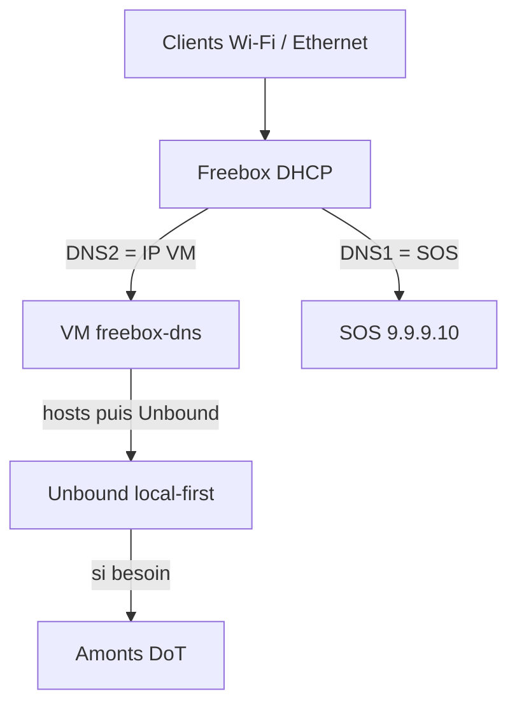

# Freebox Dual DNS — le résolveur est la **VM Freebox**, pas votre PC

**Production canonique** : stack Docker sur la **VM Freebox OS** (ARM64).  
Tous les clients Wi‑Fi / Ethernet du LAN résolvent via le **DHCP Freebox** → IP de cette VM.  
Votre PC Windows / WSL / Docker Desktop = **lab / développement uniquement** — jamais le DNS système du salon.

**Guides** : [dlnraja.github.io/freebox-dns](https://dlnraja.github.io/freebox-dns/) · **Crédits** : [docs/CREDITS.md](docs/CREDITS.md)

## Qui résout le DNS ?

| Rôle | Qui | IP typique |
| --- | --- | --- |
| **Résolveur LAN (prod)** | VM `freebox-dns` sur Freebox OS | ex. `192.168.1.71` |
| Filet SOS (si VM down) | Quad9 Unsecured | `9.9.9.10` |
| PC Windows | Client DHCP / Wi‑Fi | ex. `192.168.1.15` — **pas** un serveur DNS |

DHCP Freebox recommandé : **DNS1 = `9.9.9.10`**, **DNS2 = IP_VM**.  
Détail Wi‑Fi : [docs/wifi-lan.md](docs/wifi-lan.md) · DHCP sûr : [docs/safe-freebox-deploy.md](docs/safe-freebox-deploy.md).

## Modes (sur la VM)

Smart spit : **hosts locaux → filtre mode → Unbound (local-data / cache → DoT → root)**.

| Mode | Service | Port prod | DoH | Filtrage |
| --- | --- | --- | --- | --- |
| **uncensored** | `dns-libre` | `:53` | `:8453` | Aucun denylist |
| **malware** | `dns-malware` | `:5357` | `:8445` | Menaces |
| **antipub** | `dns-antipub` | `:5358` | `:8446` | Pubs + trackers |
| **secure** | `dns-secure` | `:5354` | `:8444` | antipub + malware |

Docs : [modes](docs/modes.md) · [résilience](docs/resilience.md) · [DoH/DoT](docs/encrypted-dns.md) · [anti-lie](docs/anti-lie-dns.md).

## Architecture



## Prod — Freebox VM (recommandé)

1. Importer le QCOW2 ARM64 + cloud-init : [packaging/freebox-os-import/](packaging/freebox-os-import/) · [docs/freebox-vm.md](docs/freebox-vm.md)
2. Attendre health : `dig @IP_VM example.com`
3. Freebox OS → DHCP : DNS1=`9.9.9.10`, DNS2=`IP_VM`
4. Renouveler le bail Wi‑Fi des clients (ou redémarrer Wi‑Fi)

Guides Pages : [Déployer Freebox](https://dlnraja.github.io/freebox-dns/guides/deploy-freebox.html) · [DHCP sûr](https://dlnraja.github.io/freebox-dns/guides/dhcp-safe.html) · [Wi‑Fi / LAN](https://dlnraja.github.io/freebox-dns/guides/wifi-lan.html)

## Lab — PC / WSL (ne pas pousser en DHCP Freebox)

```bash
cp .env.example .env
# HOST_IP = IP LAN du lab seulement — PAS pour DHCP Freebox
bash scripts/generate-certs.sh
docker compose up -d          # ports 5356/5354
bash scripts/health-check.sh
```

Pi : [docs/deploy-pi.md](docs/deploy-pi.md) · WSL lab : [docs/deploy-wsl.md](docs/deploy-wsl.md)

## Fallbacks SOS épinglés

| Pin | IP | Rôle |
| --- | --- | --- |
| FREEBOX_DNS_1 | `9.9.9.10` | Quad9 Unsecured — DHCP SOS |
| FREEBOX_DNS_2 | `194.242.2.2` | Mullvad Unfiltered |
| FREEBOX_DNS_3 | `94.140.14.140` | AdGuard Non-filtering |
| FREEBOX_DNS_4 | `45.90.28.0` | NextDNS — lexique secure only |
| FREEBOX_DNS_5 | `192.168.1.254` | Passerelle Freebox |

UncensoredDNS / Digitale Gesellschaft = **DoT Unbound** (UDP/53 souvent filtré sur Free).

## Licence

MIT — voir [LICENSE](LICENSE).
